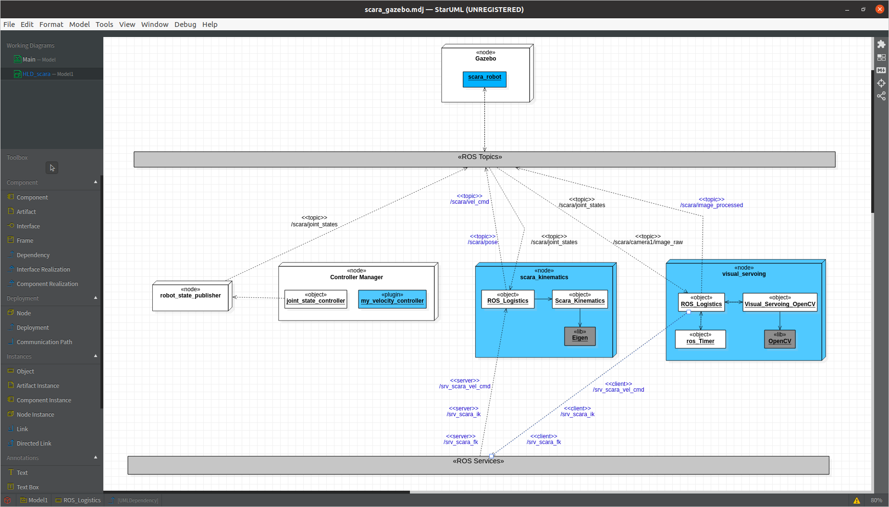
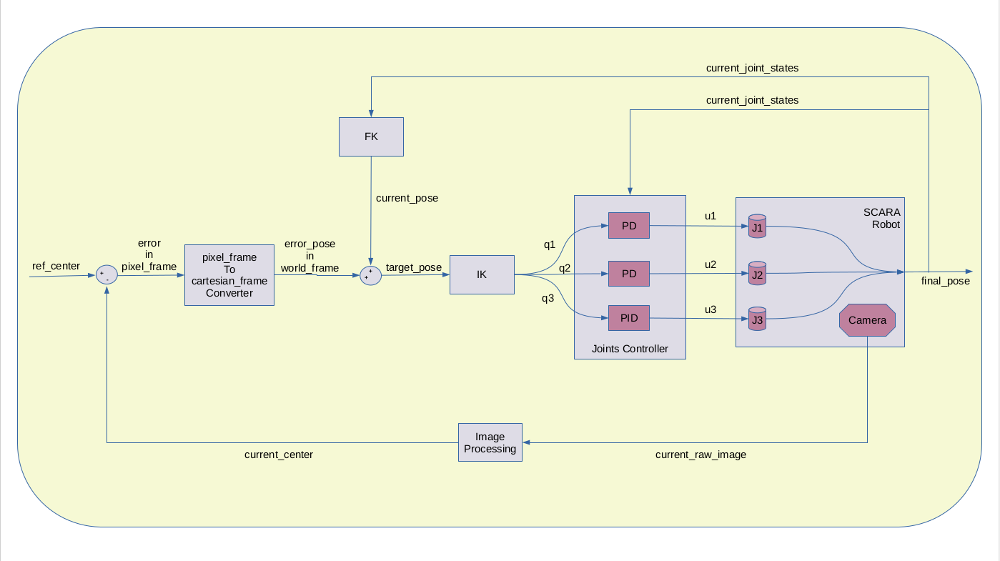

# Visual Servoing - SCARA Robot
---
## Overview
In this project, I have implemented **Position Based Visual Servoing (PBVS)** for the well-known **SCARA** robot. 

##### Demo 1 - Visual Servoing . . . *in action* !!!
> *The goal for the SCARA robot is to track the center of the object and hit the target only after the end effector stablizes after the Visual Servoing process is applied.*

  

##### Demo 2 - Visual Servoing . . . *playback using rosbag* !!!
> **Why is this useful?**  
*Let's assume that the robot had a problem in the field. In software engineering, one of the best possible way to fix a bug is to be able to replicate the same process. In the below video, even though the original environment is changed with the table being pushed away, we can still see the image and movements of the robot which will immensely help in fixing the bug in the field.**

  

##### Demo 3 - Visual Servoing . . . *plots using rosbag on rqt_gui* !!!
>*The plots represent the movement of joints during the visual servoing process. As we can observe, the change in them is gradual and this shows that the controller I've implemented and the PID gains tuned are doing a great job.  

  

---
### Deployment Diagram using UML
Deployment diagrams are a useful tool to get the BIG PICTURE of how the nodes are running and interacting with each other, especially in a multiple process environment like this one. 

The boxes highlighted in the blue are the nodes written by me. The phrases represented in the blue font are the topics and services being provided by the nodes developed by me. 

  

> *As seen, all the communication between nodes and Gazebo simulator takes place over ROS Topics and ROS Services.*

---
### High Level Design
The following block diagram gives a quick overview of the logic employed to perform Postion Based Visual Servoing for the SCARA robot.

  

---
### Tools and Frameworks
**ROS Version:** Noetic

**Gazebo Version:** 11.9.1

**IDE:** Eclipse  
*(The required setup was made to use catkin_make to build the roscpp codebase. The necessary environemnt variables were setup to debug them on the fly)*

**3rd party libraries:**
- OpenCV 4.2
- Eigen 3.4.0

**Software Modelling Tool:** Star UML  
*(The deployment diagram that describes the modular design of the code and how the different nodes interact with each other was created using this software)*

---
## <u>Work done behind the scenes</u>:
 
- **Robot Description**:  
The XACRO file for simulating the robot in Gazebo physics simulator was written from scratch. Further, the xacro file reads the robot's link diemensions from a configuration file called *"scara_config.yaml."* This is to ease the loading of these diemensions to the ROS param server and also to be able to change the robot's size without touching the complex looking xacro file. 
  

- **Object Description**:  
Another XACRO file was written to preserve the modularity of xacro files.
  

- **ROS Nodes**:    

    - **Scara Kinematics**: 
       - <u>*Forward Kinematics*</u>:  
        The FK for the scara robot was implemented using the DH table. It was further verified using the tf package using C++. The notes for it has been shown at the bottom of this page.
        
       - <u>*Inverse Kinematics*</u>:  
        The IK for the scara robot was implemented using the geometric approach. It was further verified using the FK function.
    	
       - <u>*Jacobian*</u>:  
        The Jacobian for the scara robot was implemented.
		   
		**Note**: *All of the above have been implemented as ROS Services. These services are used by the Visual Servoing node to perform the PBVS.*
		  

    - **Visual Servoing using OpenCV**:  
       - <u>*Position Based Visual Servoing*</u>:  
        This node processes the raw_image, detects the circle center, computes the change in joint positions for end effector to be centered exactly on the center of the circle and hit the target.
         
        
    - **Visual Servoing using PCL**:     
       - *Possible future work*

- **ROS Plugins**:    

    - **My Velocity Controller**:   
        The interface for the gazebo_ros controller was inheirited to write my <u>own PID controller</u>. The PID values are loaded from the ROS param server. For the integrator part of the controller, an anti-wind up logic was also realized.

- **Gazebo Launch File**:    

    - **scara.launch**:   
        This file was written from scratch to bring up the necessary nodes and load the necessary parameters.

---
#### Building

To build from source, clone the latest version from this repository into your catkin workspace and compile the package using

	$ cd catkin_workspace/src
	$ git clone https://github.com/KavitShah1998/Combined_Astar_with_RRTstar_in_ROS
	$ cd ..
	$ catkin_make

---
## Usage

* **STEP 1**: Source your catkin_workspace with 
	
	$ source ./devel/setup.bash

* **STEP 2**: Launch the SCARA with the nodes necessary for performing the PBVS
	
	$ roslaunch scara_gazebo scara.launch

* **[Optional]**:

    - **scara_control.yaml**  
    This file can be used to vary the PID gains for my custom velocity controller.
    - **scara_config.yaml**  
    This file can be used to change the diemensions of the robot on the fly.

---
    
    
